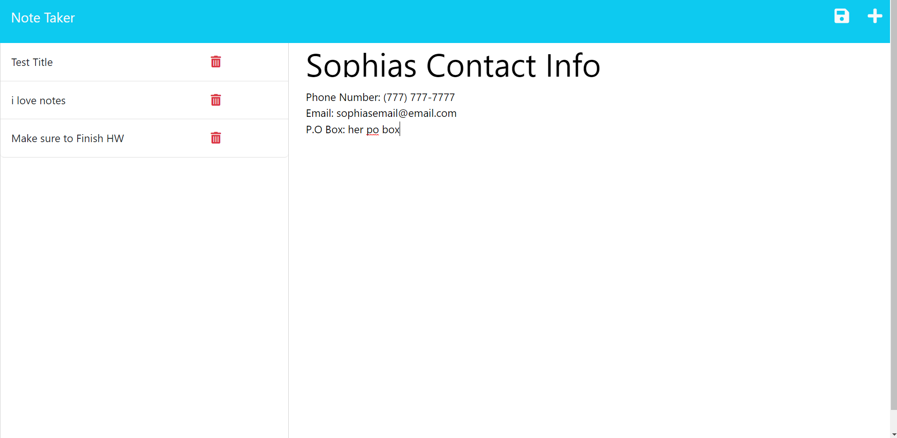

# Note Taker
  
  ## Description
  This is an application to allow the user to take quick and easy notes as the day goes on. The app uses node and express to manage the api CRUD calls and local storage to allow the user to continue to add and remove notes without the fear of loosing them.

  ___
## Deployed app link
https://notetakerapphw.herokuapp.com/notes

___
  ## Table of Contents
  * [Installation](#installation)
  * [Usage](#usage)
  * [Licenses](#licenses)
  * [Contribute](#contribute)
  * [Tests](#tests)
  ___
  ## Installation
  In order to use this app just clinck the link provided above or clone the repo to your local machine, install all dependencies, and run the command: npm start
  ___
  ## Usage
  This app is very simple. Just use the link and start by entering the title of your note then just enter the actual note info you want to save. It's that easy.
  ___
  ## Licenses
  
      This Project is utilizing the No License license. To learn more click the lisence to view.
  ___
  ## Contribute
  Feel free to add or remove code/features of the app in your local machine to improve the app. If you wish to share, comment on the repo and open an issue report.
  ## Tests
  Like in the contribution section, if you come across any bugs in use or testing, open an issue report on git hub to colab and improve on the app.
  ___
  ## Have Questions? Contact Me!
  
  Visit my GitHub: DiegoCamilli
  Contact me via Email at: camillidiego011@gmail.com

